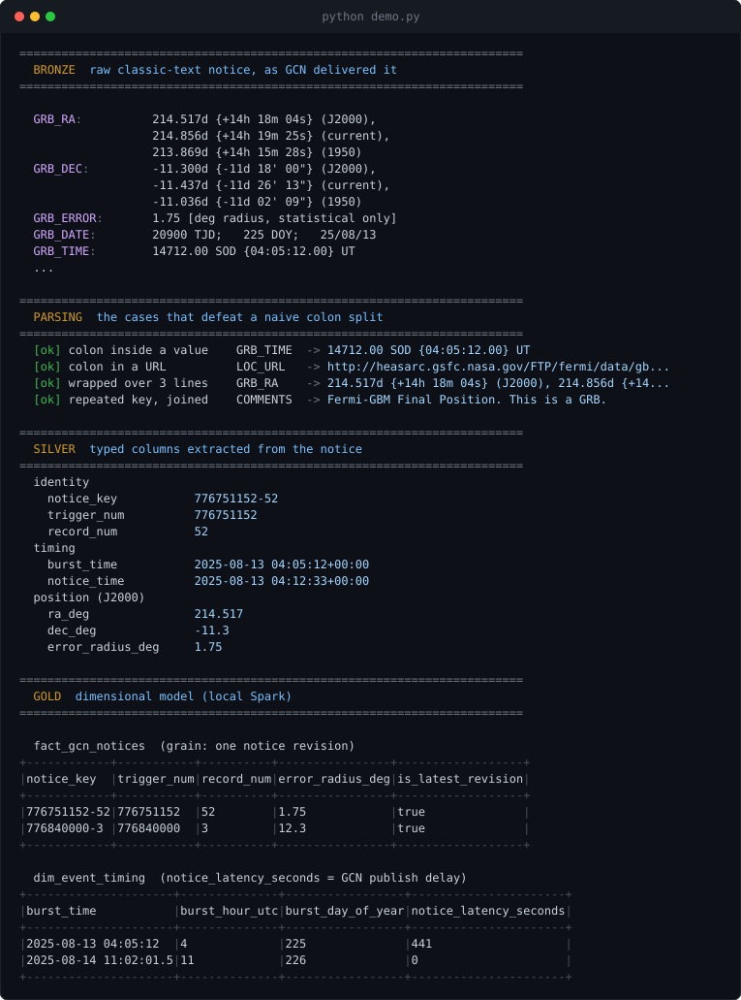
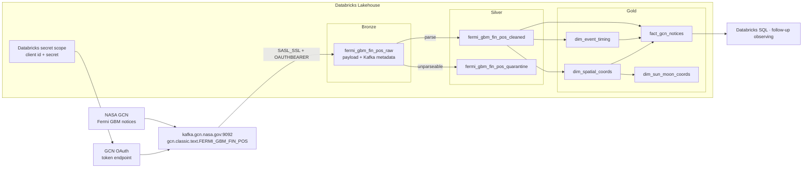

# NASA GCN Fermi Streaming Lakehouse

[](https://github.com/HarshitGadge/kafka-databricks-nasa/actions/workflows/tests.yml)

Real-time data engineering pipeline that consumes **NASA General Coordinates
Network (GCN)** gamma-ray burst notices from Kafka and models them as an
analytics-ready lakehouse on Databricks.

GCN broadcasts alerts when the *Fermi* Gamma-ray Burst Monitor detects a burst.
This project subscribes to that feed over an OAuth-authenticated Kafka
connection, parses the human-readable notice format into typed columns, and
publishes a snowflake dimensional model for analysis.

[](https://www.python.org/)
[](https://spark.apache.org/)
[](https://www.databricks.com/)
[](https://delta.io/)
[](tests/)
[](LICENSE)

## Demo

Everything below is real output from [`demo.py`](demo.py), which runs the actual
pipeline transforms against the bundled sample notices — no credentials, no
cluster, no Databricks account:

```bash
pip install -r requirements-dev.txt
python demo.py
```

<p align="center">
  
</p>

The demo walks one real-format Fermi GBM notice through every layer: the raw
classic text as GCN delivers it, the four parsing hazards handled, the typed
Silver record, and the Gold fact and timing dimensions built on a local Spark
session.

## Architecture



## Design notes

**Parsing is pure Python, not Spark SQL.** GCN classic notices are written for
human readers, and three properties break a `split(':')` or `str_to_map`
approach:

| Hazard | Example |
|---|---|
| Colons inside values | `GRB_TIME: 14712.00 SOD {04:05:12.00} UT` |
| Colons in URLs | `LOC_URL: http://heasarc.gsfc.nasa.gov/...` |
| Values wrapped over lines | `GRB_RA` carries J2000, current and 1950 epochs |
| Repeated keys | a notice may hold any number of `COMMENTS:` lines |

`src/gcn_lakehouse/notices.py` parses line-by-line, splitting on the first colon
only and folding indented continuations onto their key. Because it is plain
`str` handling with no Spark dependency, it is unit-tested directly — the
trickiest part of the pipeline is verified without a cluster. It reaches Spark
as an Arrow-vectorised pandas UDF.

**Unknown fields are rescued, not dropped.** A notice field this project does
not model lands in a `rescued_fields` map rather than disappearing, so a change
on GCN's side is visible in the data instead of silent.

**Malformed notices are quarantined, not discarded.** Silver row counts stay
reconcilable against Bronze.

**The session timezone is pinned to UTC.** `hour()` and `dayofyear()` are
evaluated in `spark.sql.session.timeZone`; on a cluster in any other zone the
same burst instant yields a different `burst_hour_utc`. See
`src/gcn_lakehouse/session.py`.

**Dimension keys are deterministic hashes**, not generated sequences, so a
rebuild from Bronze reproduces identical keys and the MERGE stays idempotent.

**The fact grain is one notice revision, not one burst.** GCN re-issues a notice
for the same trigger as the localisation is refined; `trigger_num + record_num`
identifies a revision, and `is_latest_revision` marks the final word per burst.

## Layout

```
src/gcn_lakehouse/     parsing, schemas, config  (unit-tested, no cluster needed)
  notices.py           classic-text -> field map
  fields.py            typed value extraction (degrees, TJD dates, SOD times)
  records.py           field map -> flat Silver record
  schemas.py           explicit Spark schemas
  spark_udf.py         Arrow-vectorised UDF binding
  config.py            Kafka/OAuth options, Unity Catalog naming
  session.py           correctness-critical Spark settings
  deploy.py            shipping the package to executors
pipelines/             the three medallion jobs
setup/create_catalog.sql
demo.py                offline walkthrough of all three layers
tests/                 33 tests: parser, Spark transforms, dimensional model
docs/                  architecture, data model, notice parsing, deployment
```

## Running the tests

```bash
python -m venv .venv && source .venv/bin/activate
pip install -r requirements-dev.txt
pytest
```

The parser tests need nothing but Python. The Spark transform tests spin up a
local session and are skipped automatically if pyspark is not installed — as
does the Gold section of `demo.py`.

## Deploying

Full instructions in [docs/DEPLOYMENT.md](docs/DEPLOYMENT.md). In short:

1. Register for GCN client credentials at <https://gcn.nasa.gov/quickstart>.
2. Store them in a Databricks secret scope named `gcn`.
3. Run `setup/create_catalog.sql`.
4. Schedule `pipelines/bronze_ingest.py` → `silver_parse.py` → `gold_dimensional.py`.

## Documentation

- [Architecture](docs/ARCHITECTURE.md) — ingestion sequence and lineage
- [Data model](docs/DATA_MODEL.md) — Gold schema and example queries
- [Notice parsing](docs/NOTICE_PARSING.md) — the classic-text format in detail
- [Deployment](docs/DEPLOYMENT.md) — credentials, cluster and job setup

## Data source and credit

Notice data is produced by NASA's [General Coordinates
Network](https://gcn.nasa.gov/), a public service of NASA GSFC. This repository
contains only the pipeline; it redistributes no NASA data.

## License

MIT — see [LICENSE](LICENSE).
