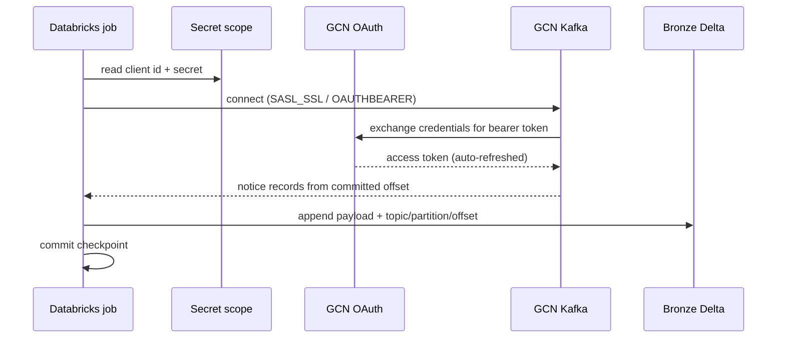
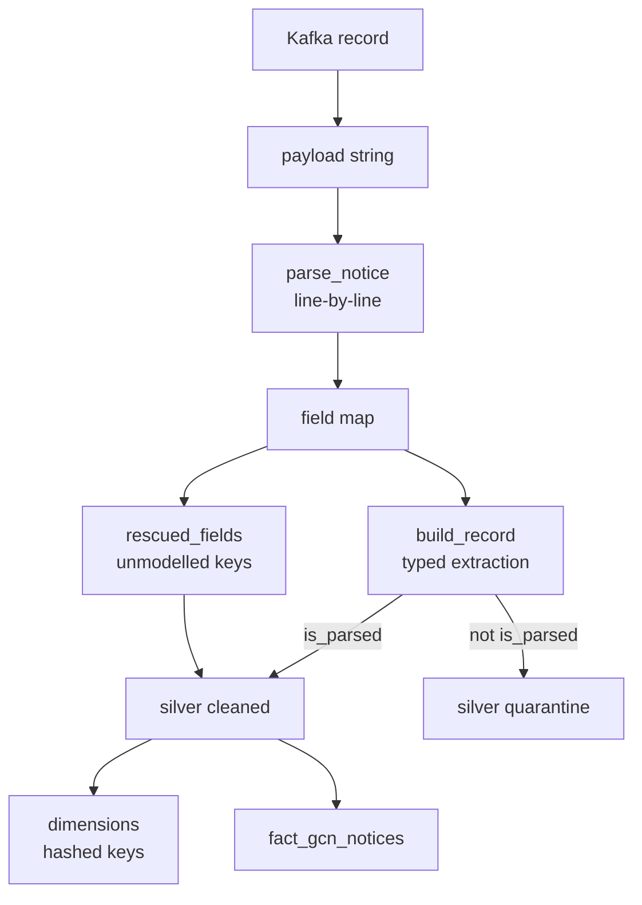

# Architecture

## Ingestion sequence

The consumer refreshes its own token, so the job never holds a long-lived
credential. The secret value appears only inside the JAAS configuration string
passed to the Kafka client; `gcn_lakehouse.config.redacted` masks it for logs.

## Layer responsibilities

| Layer | Table | Responsibility |
|---|---|---|
| Bronze | `fermi_gbm_fin_pos_raw` | Durable copy of the payload exactly as delivered, with Kafka coordinates |
| Silver | `fermi_gbm_fin_pos_cleaned` | Typed columns, one row per notice |
| Silver | `fermi_gbm_fin_pos_quarantine` | Notices that failed to parse, retained with their payload |
| Gold | `fact_gcn_notices` + dimensions | Conformed model for analysis |

Bronze performs **no** parsing. GCN retains only a bounded window of history, so
once a notice ages off the broker the raw payload in Bronze is the only copy.
Keeping it unparsed means a parser fix can be applied by replaying Bronze rather
than by re-reading from Kafka, which is no longer possible.

## Processing lineage

## Incremental processing

Every job runs with `trigger(availableNow=True)`: each run consumes what has
accumulated since the last checkpoint and exits, rather than holding a cluster
open continuously. GCN publishes a handful of Fermi GBM notices per day, so a
scheduled batch is a better fit than an always-on stream, and the streaming
checkpoint still provides exactly-once progress tracking.

Gold is rebuilt by MERGE on deterministic keys, making a re-run of the same
window a no-op rather than a source of duplicates.

## Failure handling

| Failure | Behaviour |
|---|---|
| Unparseable notice | Routed to quarantine with its payload; the batch succeeds |
| Unmodelled GCN field | Captured in `rescued_fields` |
| Missing individual value | That column is null; the row is still written |
| Kafka partition data loss | `failOnDataLoss=false`; the job continues from the next available offset |
| Replayed offsets | `dropDuplicates` on the notice business key in Gold |
