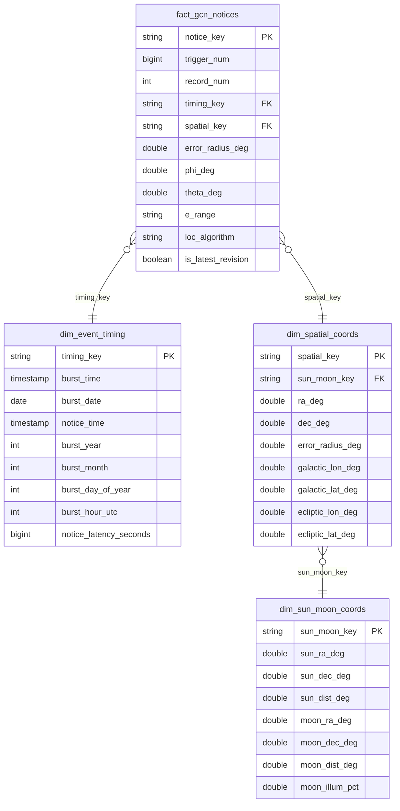

# Data model

## Gold schema



It is a snowflake rather than a star: solar and lunar geometry is a property of
*where the burst was*, so it hangs off the spatial dimension instead of being
repeated on the fact.

## Grain

One row per **notice revision**. GCN issues a new notice for the same trigger as
the localisation is refined, incrementing `RECORD_NUM`; `notice_key` is
`trigger_num-record_num`.

To analyse bursts rather than notices, filter `is_latest_revision`.

## Why these keys

`ra_deg` and `dec_deg` come from the **J2000** epoch. GCN reports each position
three times — J2000, current and 1950 — and mixing epochs across rows would put
the same burst in different places.

`burst_time` is built from the TJD day number plus seconds-of-day, not the
two-digit calendar date and `{hh:mm:ss}` gloss beside them: TJD carries no
century ambiguity and seconds-of-day keeps sub-second precision.

## Example queries

Bursts from the last 30 days, final localisation only:

```sql
SELECT f.trigger_num, t.burst_time, s.ra_deg, s.dec_deg, f.error_radius_deg
FROM kafka_nasa_fermi.gold.fact_gcn_notices f
JOIN kafka_nasa_fermi.gold.dim_event_timing  t USING (timing_key)
JOIN kafka_nasa_fermi.gold.dim_spatial_coords s USING (spatial_key)
WHERE f.is_latest_revision
  AND t.burst_time >= current_timestamp() - INTERVAL 30 DAYS
ORDER BY t.burst_time DESC;
```

How quickly GCN publishes after a burst:

```sql
SELECT
  percentile_approx(notice_latency_seconds, 0.5) AS median_seconds,
  percentile_approx(notice_latency_seconds, 0.9) AS p90_seconds,
  max(notice_latency_seconds)                    AS worst_seconds
FROM kafka_nasa_fermi.gold.dim_event_timing;
```

Well-localised bursts far from the Moon — the candidates worth a follow-up
observation:

```sql
SELECT f.trigger_num, s.ra_deg, s.dec_deg, f.error_radius_deg, m.moon_dist_deg
FROM kafka_nasa_fermi.gold.fact_gcn_notices   f
JOIN kafka_nasa_fermi.gold.dim_spatial_coords s USING (spatial_key)
JOIN kafka_nasa_fermi.gold.dim_sun_moon_coords m USING (sun_moon_key)
WHERE f.is_latest_revision
  AND f.error_radius_deg < 5
  AND m.moon_dist_deg    > 30
ORDER BY f.error_radius_deg;
```

How much a localisation moved between the first and final notice:

```sql
WITH revisions AS (
  SELECT f.trigger_num, f.record_num, s.ra_deg, s.dec_deg, f.error_radius_deg,
         row_number() OVER (PARTITION BY f.trigger_num ORDER BY f.record_num)      AS first_rev,
         row_number() OVER (PARTITION BY f.trigger_num ORDER BY f.record_num DESC) AS last_rev
  FROM kafka_nasa_fermi.gold.fact_gcn_notices f
  JOIN kafka_nasa_fermi.gold.dim_spatial_coords s USING (spatial_key)
)
SELECT a.trigger_num,
       a.error_radius_deg AS initial_error,
       b.error_radius_deg AS final_error,
       degrees(acos(least(1.0,
         sin(radians(a.dec_deg)) * sin(radians(b.dec_deg)) +
         cos(radians(a.dec_deg)) * cos(radians(b.dec_deg)) *
         cos(radians(a.ra_deg - b.ra_deg))))) AS moved_deg
FROM revisions a
JOIN revisions b ON a.trigger_num = b.trigger_num
WHERE a.first_rev = 1 AND b.last_rev = 1
ORDER BY moved_deg DESC;
```

## Data quality

```sql
SELECT
  count(*)                                             AS notices,
  sum(CASE WHEN trigger_num IS NULL THEN 1 ELSE 0 END) AS missing_trigger,
  sum(CASE WHEN ra_deg IS NULL
            OR dec_deg IS NULL THEN 1 ELSE 0 END)      AS missing_position,
  sum(CASE WHEN rescued_fields IS NOT NULL THEN 1 ELSE 0 END) AS with_unmodelled_fields
FROM kafka_nasa_fermi.silver.fermi_gbm_fin_pos_cleaned;
```

A non-zero `with_unmodelled_fields` means GCN is sending a field this model does
not yet cover — inspect `rescued_fields` and extend `records.py`.

Quarantine should normally be empty:

```sql
SELECT count(*), min(ingested_at), max(ingested_at)
FROM kafka_nasa_fermi.silver.fermi_gbm_fin_pos_quarantine;
```
